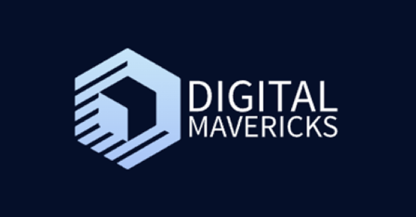

# TransitTrail

Hello there and welcome to Digital Mavericks. With our new innovative app, TransitTrail, we offer a simple solution for refugees to navigate Munich and the rural area with ease. Our app provides specific language option, ticket guidance, and behavior guidelines to ensure a smooth travel experience.
We are a young start-up that emerged after participating in a student competition organized by Hochschule München and the Bavarian Red Cross. Our mission is to support refugees in navigating through Munich and rural areas effortlessly. The TransitTrail app offers comprehensive navigation and guidance on purchasing the right tickets and behaving appropriately in public transportation. For refugees, TransitTrail offers a comprehensive all-in-one solution for public transportation. Instead of relying on multiple apps or sources for different aspects of their journey, TransitTrail provides everything they need in a single, user-friendly platform. How it works? Our storyboard will introduce our work to you.

## The Story

Niam(mother), Kami (father) and Ahmet (child) are standing at a bus stop in Germany (Munich). They have recently arrived in the country as a refugee family and want to use public transportation to get to the shelter. But they have trouble understanding the instructions on the timetables and are unsure which bus to take.

The family asks a pedestrian for help, but the man doesn't speak English and doesn't understand their mother language. They feel helpless and lost.

A few minutes later, Niam remembers that the Bavarian Red Cross (BRK) had recommended an app to help them find their way around public transportation. They open the app on their smartphone and enter the destination address.

The app shows them not only the exact bus they need to take, but also how to buy the ticket and where to board the bus. Ahmed and Kami are relieved and grateful for the help they received from the "TransitTrail" app. Niam buys the ticket through the app and shows her child where to sit on the bus.

They take the bus and arrive at their destination without any further problems. Niam, Ahmed, and Kami are relieved and happy to have found the help they needed to use public transportation in Germany. They feel a little more arrived in their new home.

## The problem
"How might we provide refugees with a user-friendly and accessible solution to overcome language barriers, navigate complex transportation systems, understand ticketing options, and learn appropriate behavior in order to enhance their mobility and integration?"

## The solution
Our solution is designed as a user-friendly app with intuitive interface and features. It incorporates multilingual support to cater to diverse language needs, offers clear and step-by-step navigation instructions, provides comprehensive information on ticket types and prices, and includes guidelines on proper behavior in public transportation. The design focuses on simplicity, accessibility, and addressing the specific needs of refugees to ensure a seamless and inclusive experience.

## The Prototype
Experience the power of TransitTrail - the innovative app designed to revolutionize the public transportation journey for refugees. Try it now and discover how it simplifies their travel experience --> 
[View the final Prototype](https://www.figma.com/proto/totawtIjV2GnzCP89MHO1a/Team-Canvas?type=design&node-id=142-1385&scaling=scale-down&page-id=106%3A8&starting-point-node-id=142%3A1385)

## The Team

<table>
  <tr>
    <th> Name </th>
    <th> Surname </th>
    <th> University </th>
    <th> Faculty </th>
    <th> City </th>
  </tr>
  <tr>
    <td> David </td>
    <td> Fuchs </td>
    <td> University of Applied Sciences Munich </td>
    <td> FK07 </td>
    <td> Munich </td>
  </tr>
  <tr>
    <td> Donel </td>
    <td> Lutete </td>
    <td> University of Applied Sciences Munich </td>
    <td> FK10 </td>
    <td> Munich </td>
  </tr>
  <tr>
    <td> Katharina </td>
    <td> Kotz </td>
    <td> University of Applied Sciences Munich </td>
    <td> FK07 </td>
    <td> Munich </td>
  </tr>
  <tr>
    <td> Vijay </td>
    <td> Dawn </td>
    <td> University of Applied Sciences Munich </td>
    <td> FK07 </td>
    <td> Munich </td>
  </tr>
</table>

## Further information
We hope you are interested and want to learn more about our product. Feel free to explore our repository and Wiki.

Github Startpage: [https://real-projects-digitalization.github.io/ss22-team-5-ss23/](https://real-projects-digitalization.github.io/ss22-team-5-ss23/)

Git Wiki: [https://github.com/Real-Projects-Digitalization/ss22-team-5-ss23/wiki](https://github.com/Real-Projects-Digitalization/ss22-team-5-ss23/wiki)
